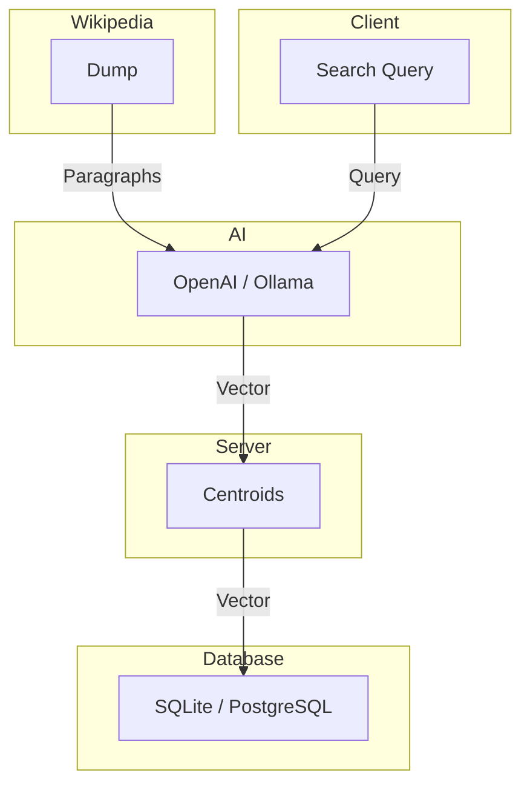

# Vectorpedia

Vectorpedia is a high-performance vector search engine for a Wikipedia data dump. It is powered by [https://github.com/expki/go-vectorsearch](https://github.com/expki/go-vectorsearch/) library. Vector embedding search allows retrieve more relevant and semantically similar articles by understanding the meaning behind words, not just exact matches. This enables faster, more accurate search results, especially for complex or ambiguous queries.

## Demo: [https://vectorpedia.vdh.dev/](https://vectorpedia.vdh.dev/)

The [https://vectorpedia.vdh.dev/](https://vectorpedia.vdh.dev/) uses [nomic-ai/nomic-embed-text-v2-moe](https://huggingface.co/nomic-ai/nomic-embed-text-v2-moe) LLM implemented in [https://github.com/expki/ai-network](https://github.com/expki/ai-network). However currently it does not provide great accuracy for Wikipedia data dumps and gets easily distracted by nouns in paragraphs skewing results. Finetune might solve this, however this is currently low priority.

## Design



## Technologies Used

- **VectorEmbedding**  
 [https://vectorpedia.vdh.dev/](https://vectorpedia.vdh.dev/) similarity measures the similarity between search queries and Wikipedia paragraphs producing 100 nearest results.
  This is displayed as a percentage match against each document.

## Development

This project has two main components:

1. Divide and Conquer  
  The `server/` implements the libary methods and API methods to use the Wikipedia search engine. 

2. Website  
  The `ui/` directory implements Vectorpeida search engine website where users can search paragraphs. 

- Dependancies
  - Linux (or Windows with WSL), Windows (not fun to get working)
  - Golang >=1.24.3
  - GCC => 8.0
  - Node >= 22.0
  - OpenAI / Ollama API URL

- Run development
```bash
go run .
```

- Build for production
```bash
./build.sh
```

## Operations

Running the executable will produce a `config.json` file in the current directory. Modify this file to configure your database settings and other parameters.

### Run App
The configuration file is auto generated if it does not exist.

#### Linux

```bash
./build/vectorpedia ./config.json
```

#### Windows

```powershell
./build/vectorpedia ./config.json
```

### Import Wikipedia Dump
The configuration file is auto generated if it does not exist. Simply download the latest full [https://dumps.wikimedia.org/](https://dumps.wikimedia.org/).

#### Linux

```bash
./build/vectorpedia ./config.json ./wikipedia-dump.xml.br
```

#### Windows

```powershell
./build/vectorpedia ./config.json ./wikipedia-dump.xml.br
```

### Configuration
The `config.json` file contains all necessary configuration for the application, including:
- Database type (SQLite or PostgreSQL)
- Connection strings for each database type
- Ollama server URL
Not all configuration is required, the autogenerated configuration is sufficient for a MVP installation.
```json
{
    "server": {
        "http_address": ":7600",
        "https_address": ":7601"
    },
    "tls": {
        "dns": ["computer001.localdomain"],
        "ip": ["192.168.1.100"],
        "certificates": [
            {
                "cert_path": "/etc/ssl/certs/server.pem",
                "key_path": "/etc/ssl/private/server.pem"
            }
        ]
    },
    "database": {
        "sqlite": "./vectors.db",
        "postgres": ["host=localhost user=vectorsearch password=1234 dbname=vectordb port=9920 sslmode=disable"],
        "postgres_readonly": ["host=localhost user=vectorsearch password=1234 dbname=vectordb port=9920 sslmode=disable"]
    },
    "ollama": {
        "url": "https://ollama.vdh.dev",
        "embed": "nomic-embed-text",
        "generate": "llama3.2",
        "chat": "llama3.2",
        "token": "bearer-auth-token-1234"
    },
    "cache": "./cache/",
    "log_level": "error"
}
```
